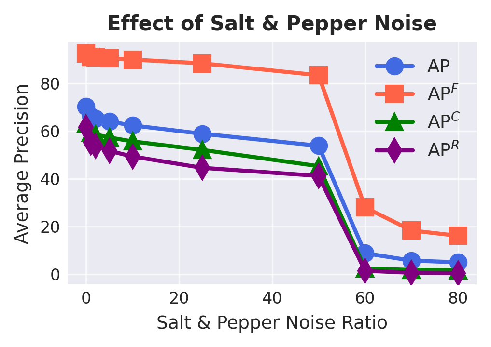
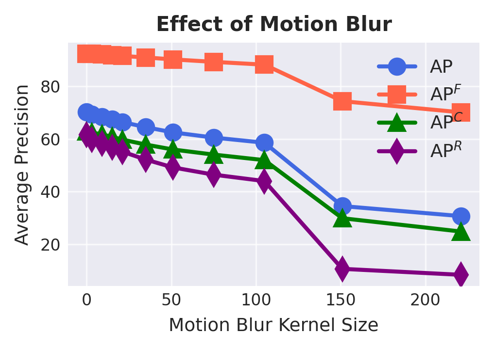
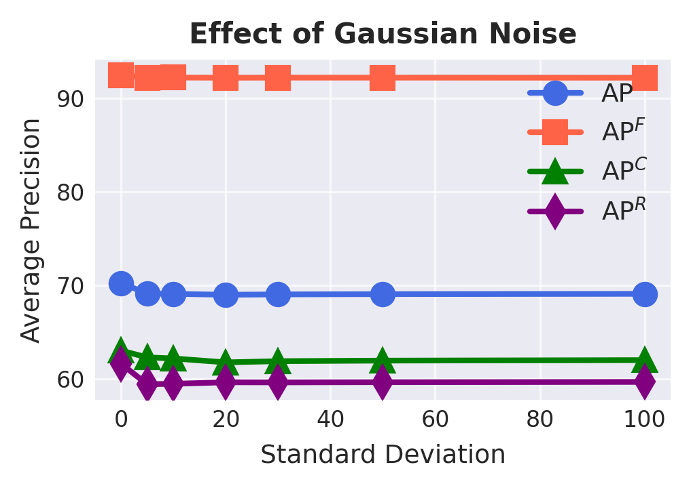
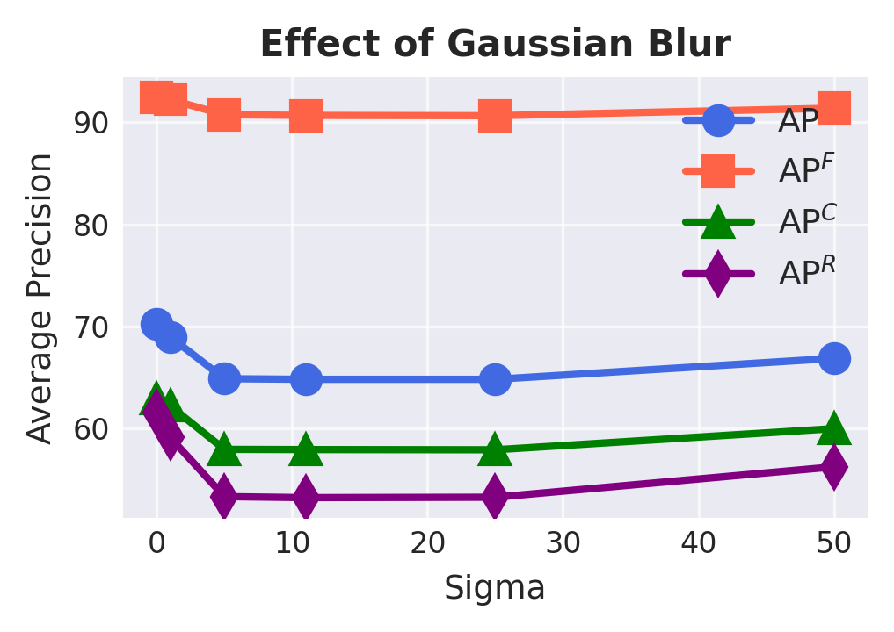
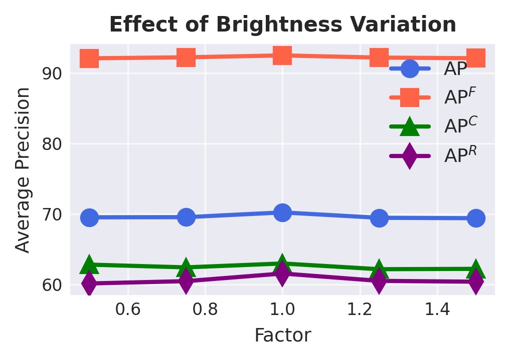
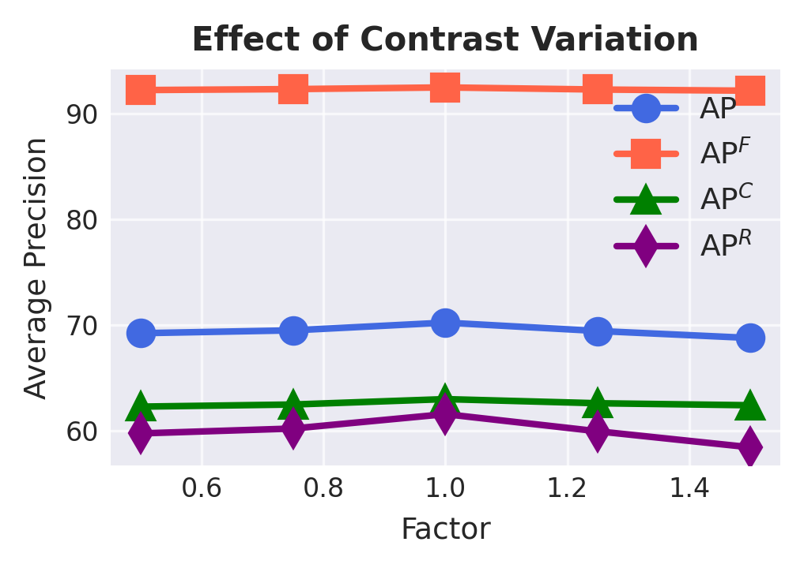
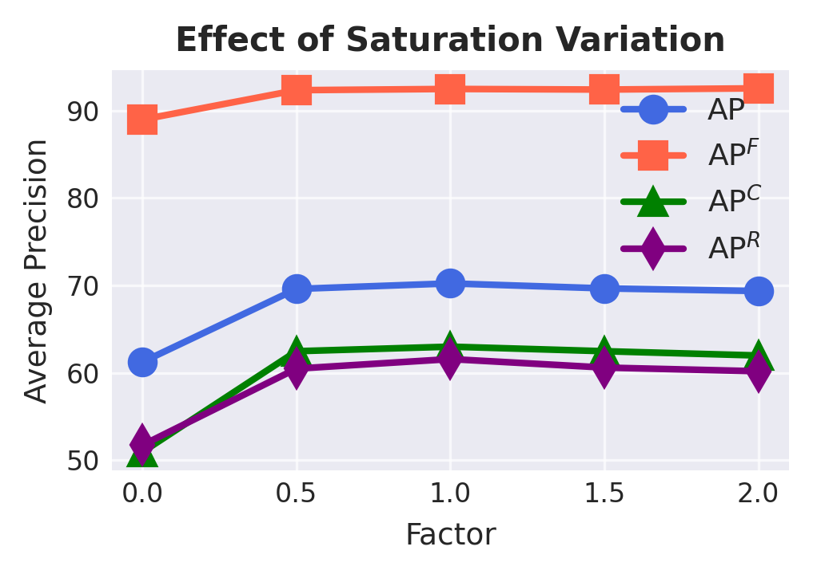
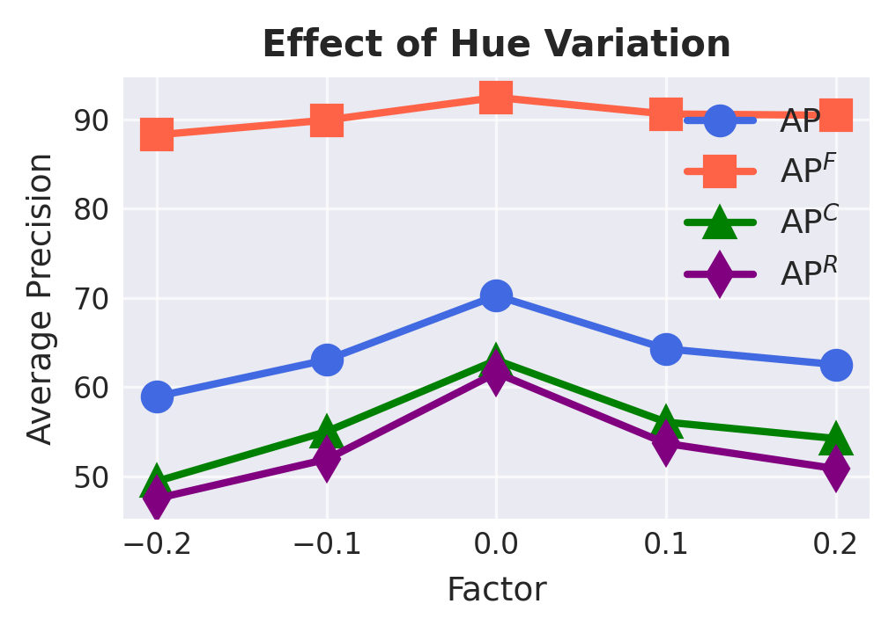

# CAM-Seg: A Continuous-valued Embedding Approach for Semantic Image Generation

**Official PyTorch Implementation**

This is a PyTorch/GPU implementation of the paper [CAM-Seg: A Continuous-valued Embedding Approach for Semantic Image Generation](https://arxiv.org/abs/2503.15617)

```
@article{ahmed2025cam,
  title={CAM-Seg: A Continuous-valued Embedding Approach for Semantic Image Generation},
  author={Ahmed, Masud and Hasan, Zahid and Haque, Syed Arefinul and Faridee, Abu Zaher Md and Purushotham, Sanjay and You, Suya and Roy, Nirmalya},
  journal={arXiv preprint arXiv:2503.15617},
  year={2025}
}
```

HuggingFace Repo: [https://huggingface.co/mahmed10](https://huggingface.co/mahmed10)

## Abstract
Traditional transformer-based semantic segmentation relies on quantized embeddings. However, our analysis reveals that autoencoder accuracy on segmentation mask using quantized embeddings (e.g. VQ-VAE) is 8\% lower than continuous-valued embeddings  (e.g. KL-VAE). Motivated by this, we propose a continuous-valued embedding framework for semantic segmentation. By reformulating semantic mask generation as a continuous image-to-embedding diffusion process, our approach eliminates the need for discrete latent representations while preserving fine-grained spatial and semantic details. Our key contribution includes a diffusion-guided autoregressive transformer that learns a continuous semantic embedding space by modeling long-range dependencies in image features. Our framework contains a unified architecture combining a VAE encoder for continuous feature extraction, a diffusion-guided transformer for conditioned embedding generation, and a VAE decoder for semantic mask reconstruction. Our setting facilitates zero-shot domain adaptation capabilities enabled by the continuity of the embedding space. Experiments across diverse datasets (e.g., Cityscapes and domain-shifted variants) demonstrate state-of-the-art robustness to distribution shifts, including adverse weather (e.g., fog, snow) and viewpoint variations. Our model also exhibits strong noise resilience, achieving robust performance ($\approx$ 95\% AP compared to baseline) under gaussian noise, moderate motion blur, and moderate brightness/contrast variations, while experiencing only a moderate impact ($\approx$ 90\% AP compared to baseline) from 50\% salt and pepper noise, saturation and hue shifts.

## Result
Trained on Cityscape dataset and tested on SemanticKITTI, ACDC, CADEdgeTune dataset
<p align="center">
  
</p>

Quantitative results of semantic segmentation under various noise conditions
<p align="center">
    <table>
      <tr>
        <td align="center"><br>Salt & Pepper Noise</td>
        <td align="center"><br>Motion Blur</td>
        <td align="center"><br>Gaussian Noise</td>
        <td align="center"><br>Gaussian Blur</td>
      </tr>
      <tr>
        <td align="center"><br>Brightness Variation</td>
        <td align="center"><br>Contrast Variation</td>
        <td align="center"><br>Saturation Variation</td>
        <td align="center"><br>Hue Variation</td>
      </tr>
    </table>
</p>

## Prerequisite
To install the docker environment, first edit the `docker_env/Makefile`:
```
IMAGE=img_name/dl-aio
CONTAINER=containter_name
AVAILABLE_GPUS='0,1,2,3'
LOCAL_JUPYTER_PORT=18888
LOCAL_TENSORBOARD_PORT=18006
PASSWORD=yourpassword
WORKSPACE=workspace_directory
```
- Edit the `img_name`, `containter_name`, `available_gpus`, `jupyter_port`, `tensorboard_port`, `password`, `workspace_directory`

1. For the first time run the following commands in terminal:
```
cd docker_env
make docker-build
make docker-run
```
2. or further use to docker environment
- To stop the environmnet: `make docker-stop`
- To resume the environmente: `make docker-resume`

For coding open a web browser `ip_address:jupyter_port` e.g.,`http://localhost:18888`

## Dataset
Four Dataset is used in the work
1. [Cityscapes Dataset](https://www.cityscapes-dataset.com/)
2. [KITTI Dataset](https://www.cvlibs.net/datasets/kitti/eval_step.php)
3. [ACDC Dataset](https://acdc.vision.ee.ethz.ch/)
4. [CAD-EdgeTune Dataset](https://ieee-dataport.org/documents/cad-edgetune)

**Modify the trainlist and vallist file to edit train and test split**

### Dataset structure
- Cityscapes Dataset
```
|-CityScapes
|----leftImg8bit 
|--------train
|------------aachen #contians the RGB images
|------------bochum #contians the RGB images
|................
|------------zurich #contians the RGB images
|--------val
|................
|----gtFine 
|--------train
|------------aachen #contians the RGB images #contains semantic segmentation labels
|------------bochum #contians the RGB images #contains semantic segmentation labels
|................
|------------zurich #contians the RGB images #contains semantic segmentation labels
|--------val
|................
|----trainlist.txt #image list used for training
|----vallist.txt #image list used for testing
|----cityscape.yaml #configuration file for CityScapes dataset
```

- ACDC Dataset
```
|-ACDC
|----rgb_anon 
|--------fog
|------------train
|----------------GOPR0475 #contians the RGB images
|----------------GOPR0476 #contians the RGB images
|................
|----------------GP020478 #contians the RGB images
|------------val
|................
|--------rain
|................
|--------snow
|................
|----gt 
|--------fog
|------------train
|----------------GOPR0475 #contains semantic segmentation labels
|----------------GOPR0476 #contains semantic segmentation labels
|................
|----------------GP020478 #contains semantic segmentation labels
|------------val
|................
|--------rain
|................
|--------snow
|................
|----vallist_fog.txt #image list used for testing fog data
|----vallist_rain.txt #image list used for testing rain data
|----vallist_snow.txt #image list used for testing snow data
|----acdc.yaml #configuration file for ACDC dataset
```

- SemanticKitti Dataset
```
|-SemanticKitti
|----training 
|--------image_02
|------------0000 #contians the RGB images
|------------0001 #contians the RGB images
|................
|------------0020 #contians the RGB images
|----kitti-step
|--------panoptic_maps
|------------train
|----------------0000 #contains semantic segmentation labels
|----------------0001 #contains semantic segmentation labels
|................
|----------------0020 #contains semantic segmentation labels
|------------val
|................
|----trainlist.txt #image list used for training
|----vallist.txt #image list used for testing
|----semantickitti.yaml #configuration file for SemanticKitti dataset
```

- CADEdgeTune Dataset
```
|-CADEdgeTune
|----SEQ1
|--------Images #contians the RGB images
|--------LabelMasks #contains semantic segmentation labels
|----SEQ2
|--------Images #contians the RGB images
|--------LabelMasks #contains semantic segmentation labels
|................
|----SEQ17
|----all.txt #image list complete
|----trainlist.txt #image list used for training
|----vallist.txt #image list used for testing
|----cadedgetune.yaml #configuration file for CADEdgeTune dataset
```


## Weights
To download the pretrained weights please visit [Hugging Face Repo](https://huggingface.co/mahmed10/CAM-Seg)
- **LDM model** Pretrained model from Rombach et al.'s Latent Diffusion Models is used [Link](https://huggingface.co/mahmed10/CAM-Seg/resolve/main/pretrained_models/vae/modelf16.ckpt)
- **MAR model** Following mar model is used

|Training Data|Model|Params|Link|
|-------------|-----|------|----|
|Cityscapes | Mar-base| 217M|[link](https://huggingface.co/mahmed10/CAM-Seg/resolve/main/pretrained_models/mar/city768.16.pth)|


Download this weight files and organize as follow
```
|-pretrained_models
|----mar
|--------city768.16.pth
|----vae
|--------modelf16.ckpt
```

**Alternative code to automatically download pretrain weights**
```
import os
import requests

# Define URLs and file paths
files_to_download = {
    "https://huggingface.co/mahmed10/CAM-Seg/resolve/main/pretrained_models/vae/modelf16.ckpt":
        "pretrained_models/vae/modelf16.ckpt",
    "https://huggingface.co/mahmed10/CAM-Seg/resolve/main/pretrained_models/mar/city768.16.pth":
        "pretrained_models/mar/city768.16.pth"
}

for url, path in files_to_download.items():
    os.makedirs(os.path.dirname(path), exist_ok=True)

    print(f"Downloading from {url}...")
    response = requests.get(url, stream=True)
    if response.status_code == 200:
        with open(path, 'wb') as f:
            for chunk in response.iter_content(chunk_size=8192):
                f.write(chunk)
        print(f"Saved to {path}")
    else:
        print(f"Failed to download from {url}, status code {response.status_code}")
```

## Validation
Open the `validation.ipnyb` file

Edit the **Block 6** to select which dataset is to use for validation

```
dataset_train = cityscapes.CityScapes('dataset/CityScapes/vallist.txt', data_set= 'val', transform=transform_train,seed=36, img_size=768)
# dataset_train = umbc.UMBC('dataset/UMBC/all.txt', data_set= 'val', transform=transform_train,seed=36, img_size=768)
# dataset_train = acdc.ACDC('dataset/ACDC/vallist_fog.txt', data_set= 'val', transform=transform_train,seed=36, img_size=768)
# dataset_train = semantickitti.SemanticKITTI('dataset/SemanticKitti/vallist.txt', data_set= 'val', transform=transform_train, seed=36, img_size=768)
```

Run all the blocks

## Training

### From Scratch

Run the following code in terminal
```
torchrun --nproc_per_node=4 train.py
```

it will save checkpoint in `output_dir/year.month.day.hour.min` folder, for e.g. `output_dir/2025.05.09.02.27`

### Resume Training

Run the following code in terminal
```
torchrun --nproc_per_node=4 train.py --resume year.month.day.hour.min
```

Here is an example code
```
torchrun --nproc_per_node=4 train.py --resume 2025.05.09.02.27
```

## Acknowlegement
The code is developed on top following codework
1. [latent-diffusion](https://github.com/CompVis/latent-diffusion)
2. [mar](https://github.com/LTH14/mar)
